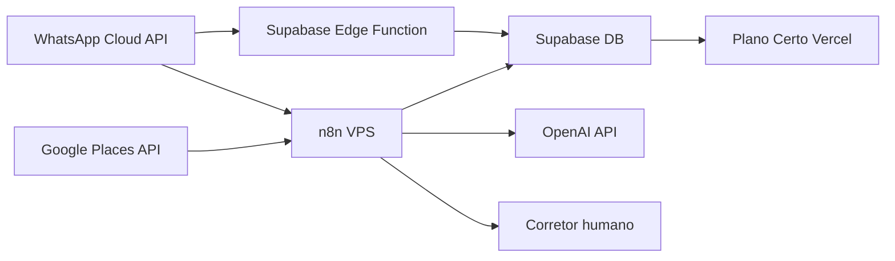

# Plano Certo - Ambiente de automacao

## Decisao operacional

Vamos preparar uma camada de automacao de baixo custo usando:

- Hostinger VPS ou VPS equivalente.
- n8n self-hosted.
- Supabase como banco operacional.
- Vercel para frontend.
- WhatsApp Business Cloud API como canal oficial.
- Google Maps Platform Places API para descoberta de empresas.
- OpenAI API para classificacao, resumo e sugestao de abordagem.

## O que assinar/habilitar

### Obrigatorio para MVP

- VPS com Docker ou Hostinger n8n VPS.
- Dominio ou subdominio para n8n: `automacoes.<dominio>`.
- Meta Business Manager.
- WhatsApp Business Account.
- Numero dedicado para WhatsApp Business Cloud API.
- Google Cloud Billing com Maps Platform/Places API habilitado.
- OpenAI API key.

### Ja temos preparado

- Supabase project `errbmfumiixmyjiltdtq`.
- Vercel deploy do frontend.
- Edge Function `whatsapp-webhook` publicada.
- Banco com `whatsapp_conversations`, `messages`, `broker_handoffs` e `whatsapp_webhook_events`.
- Scripts de smoke test do webhook.

## Arquitetura inicial

## Fluxo MVP

1. Google Places encontra empresas por nicho e regiao.
2. n8n deduplica e salva leads no Supabase.
3. WhatsApp recebe mensagens e registra no Supabase.
4. Agente classifica lead e gera resumo.
5. Quando houver preco, rede, tabela ou urgencia, cria handoff.
6. Corretor assume no frontend e confirma informacoes comerciais.
7. Respostas ao cliente passam por aprovacao humana.

## Fronteiras de seguranca

- n8n pode usar service role, mas apenas na VPS.
- Frontend usa apenas publishable key.
- Webhook publico deve validar token no GET e assinatura Meta no POST.
- Nunca enviar tabela/preco automaticamente.
- Toda mensagem enviada deve ter registro em `messages`.
- Toda decisao do agente deve virar evento/auditoria antes de escalar automacao.

## Checklist antes de assinar

- Definir dominio/subdominio para n8n.
- Decidir se usaremos template Hostinger n8n ou VPS limpa com Docker.
- Separar numero de WhatsApp que nao esteja preso a uso pessoal.
- Confirmar quem tera acesso ao Meta Business Manager.
- Definir limite inicial de gasto Google Places.
- Definir limite mensal inicial OpenAI.
- Criar email administrativo para alertas.

## Checklist apos assinar

1. Apontar DNS `automacoes.<dominio>` para a VPS.
2. Subir n8n via `infra/n8n`.
3. Configurar secrets no `.env` da VPS.
4. Acessar n8n e criar credenciais:
   - Supabase.
   - WhatsApp Business Cloud.
   - Google Places.
   - OpenAI.
5. Importar/criar workflows MVP.
6. Testar webhook WhatsApp com token real.
7. Testar criacao de lead via Google Places.
8. Testar handoff para corretor.
9. Ativar alertas de erro/custo.

## Custos sob controle

- Comecar com lotes pequenos de Google Places.
- Usar cache antes de Place Details.
- Evitar mensagens iniciadas em massa no WhatsApp.
- Usar OpenAI apenas em classificacao, resumo e sugestao.
- Revisar logs semanalmente ate estabilizar.
